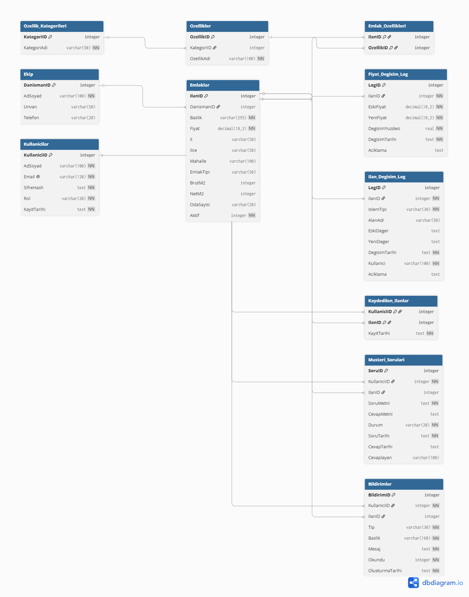

# 📐 Database Schema — Table Descriptions

## 👥 Team Members
**Altay Yeles · Alper Güner · Mustafa Ulaş Karaaslan · Mehmet Can Öztürk · Emre Aslan**

---
## Entity Relationship Diagram

---

## Table Details

### 1. `Ekip`
Stores information about agents and store owners in the real estate office.

| Column | Type | Constraint | Description |
|---|---|---|---|
| `DanismanID` | INTEGER | PK, AUTOINCREMENT | Unique identifier for the agent |
| `AdSoyad` | VARCHAR(100) | NOT NULL | Full name of the staff member |
| `Unvan` | VARCHAR(50) | — | Agent / Store Owner, etc. |
| `Telefon` | VARCHAR(20) | — | Contact number |

---

### 2. `Emlaklar`
Stores core data of rental and for-sale property listings in the portfolio.

| Column | Type | Constraint | Description |
|---|---|---|---|
| `IlanID` | INTEGER | PRIMARY KEY | Unique listing number (1000–1009) |
| `DanismanID` | INT | FK → Ekip | Reference to the associated agent |
| `Baslik` | VARCHAR(255) | NOT NULL | Listing title |
| `Fiyat` | DECIMAL(18,2) | NOT NULL | Monthly rent / sale price (TL) |
| `İl` | VARCHAR(50) | — | City |
| `İlce` | VARCHAR(50) | — | District (Beyoğlu, Şişli, etc.) |
| `Mahalle` | VARCHAR(100) | — | Neighborhood name |
| `EmlakTipi` | VARCHAR(50) | — | Rental Apartment, Rental Office, etc. |
| `BrutM2` | INT | — | Gross square meters |
| `NetM2` | INT | — | Net square meters |
| `OdaSayisi` | VARCHAR(20) | — | Room layout such as 1+1, 2+1 |
| `Aktif` | INTEGER | DEFAULT 1 | Soft-delete flag; `0` means the listing is hidden from site/admin lists |

---

### 3. `Ozellik_Kategorileri`
Main headings that provide grouping for features.

| Column | Type | Constraint | Description |
|---|---|---|---|
| `KategoriID` | INTEGER | PK, AUTOINCREMENT | Category identifier |
| `KategoriAdi` | VARCHAR(50) | NOT NULL | Interior Feature / Exterior Feature / Orientation |

**Existing Categories:**

| ID | Category Name | Example Features |
|---|---|---|
| 1 | İç Özellik (Interior Feature) | ADSL, Air Conditioning, Steel Door, Terrace, Double Glazing... |
| 2 | Dış Özellik (Exterior Feature) | Security Camera, Thermal Insulation, Satellite, Generator... |
| 3 | Cephe (Orientation) | East, West, South, North |

---

### 4. `Ozellikler`
Contains the full feature pool linked to categories.

| Column | Type | Constraint | Description |
|---|---|---|---|
| `OzellikID` | INTEGER | PK, AUTOINCREMENT | Feature identifier |
| `KategoriID` | INT | FK → Ozellik_Kategorileri | The category it belongs to |
| `OzellikAdi` | VARCHAR(100) | NOT NULL | Feature text |

**Total:** 81 features — 53 Interior Features · 24 Exterior Features · 4 Orientations

---

### 5. `Emlak_Ozellikleri` *(Bridge / Junction Table)*
Resolves the **many-to-many (M:N)** relationship between Emlaklar and Ozellikler.

| Column | Type | Constraint | Description |
|---|---|---|---|
| `IlanID` | INT | FK → Emlaklar | Reference to the listing |
| `OzellikID` | INT | FK → Ozellikler | Reference to the feature |
| *(IlanID + OzellikID)* | — | COMPOSITE PK | Composite primary key |

> A listing can have multiple features; the same feature can be assigned to multiple listings.

---

### 6. `Fiyat_Degisim_Log`
Stores price change audit records generated automatically by the update trigger.

| Column | Type | Constraint | Description |
|---|---|---|---|
| `LogID` | INTEGER | PK, AUTOINCREMENT | Unique audit record identifier |
| `IlanID` | INT | FK → Emlaklar | Listing whose price changed |
| `EskiFiyat` | DECIMAL(18,2) | NOT NULL | Previous listing price |
| `YeniFiyat` | DECIMAL(18,2) | NOT NULL | Updated listing price |
| `DegisimYuzdesi` | REAL | NOT NULL | Percentage change |
| `DegisimTarihi` | TEXT | DEFAULT datetime | Local timestamp of the change |
| `Aciklama` | TEXT | — | Trigger or application note |

---

### 7. `Ilan_Degisim_Log`
Stores admin panel listing changes, including listing creation, field updates, and price updates.

| Column | Type | Constraint | Description |
|---|---|---|---|
| `LogID` | INTEGER | PK, AUTOINCREMENT | Unique history record identifier |
| `IlanID` | INT | FK → Emlaklar | Listing affected by the admin action |
| `IslemTipi` | VARCHAR(30) | NOT NULL | Action type such as EKLEME, GUNCELLEME, FIYAT_GUNCELLEME |
| `AlanAdi` | VARCHAR(50) | — | Field changed, such as Fiyat or Mahalle |
| `EskiDeger` | TEXT | — | Previous value |
| `YeniDeger` | TEXT | — | New value |
| `DegisimTarihi` | TEXT | DEFAULT datetime | Local timestamp of the change |
| `Kullanici` | VARCHAR(100) | DEFAULT admin | Admin user that made the change |
| `Aciklama` | TEXT | — | Admin note |

---

### 8. `Kullanicilar`
Stores registered customer accounts.

| Column | Type | Constraint | Description |
|---|---|---|---|
| `KullaniciID` | INTEGER | PK, AUTOINCREMENT | Customer identifier |
| `AdSoyad` | VARCHAR(100) | NOT NULL | Customer full name |
| `Email` | VARCHAR(120) | UNIQUE, NOT NULL | Login e-mail |
| `SifreHash` | TEXT | NOT NULL | Hashed password |
| `Rol` | VARCHAR(20) | DEFAULT musteri | User role |
| `KayitTarihi` | TEXT | DEFAULT datetime | Registration timestamp |

---

### 9. `Kaydedilen_Ilanlar`
Stores customer saved/favorite listings.

| Column | Type | Constraint | Description |
|---|---|---|---|
| `KullaniciID` | INT | FK → Kullanicilar | Customer |
| `IlanID` | INT | FK → Emlaklar | Saved listing |
| `KayitTarihi` | TEXT | DEFAULT datetime | Save timestamp |
| *(KullaniciID + IlanID)* | — | COMPOSITE PK | Prevents duplicate saves |

---

### 10. `Musteri_Sorulari`
Stores questions sent by customers and answers written by admins.

| Column | Type | Constraint | Description |
|---|---|---|---|
| `SoruID` | INTEGER | PK, AUTOINCREMENT | Question identifier |
| `KullaniciID` | INT | FK → Kullanicilar | Customer who asked |
| `IlanID` | INT | FK → Emlaklar, nullable | Related listing, if any |
| `SoruMetni` | TEXT | NOT NULL | Customer question |
| `CevapMetni` | TEXT | — | Admin answer |
| `Durum` | VARCHAR(20) | DEFAULT Açık | Question status |
| `SoruTarihi` | TEXT | DEFAULT datetime | Question timestamp |
| `CevapTarihi` | TEXT | — | Answer timestamp |
| `Cevaplayan` | VARCHAR(100) | — | Admin e-mail |

---

### 11. `Bildirimler`
Stores customer notifications for admin answers and saved-listing changes.

| Column | Type | Constraint | Description |
|---|---|---|---|
| `BildirimID` | INTEGER | PK, AUTOINCREMENT | Notification identifier |
| `KullaniciID` | INT | FK → Kullanicilar | Recipient customer |
| `IlanID` | INT | FK → Emlaklar, nullable | Related listing |
| `Tip` | VARCHAR(30) | NOT NULL | Notification type |
| `Baslik` | VARCHAR(160) | NOT NULL | Notification title |
| `Mesaj` | TEXT | NOT NULL | Notification body |
| `Okundu` | INTEGER | DEFAULT 0 | Read flag |
| `OlusturmaTarihi` | TEXT | DEFAULT datetime | Notification timestamp |

---

## Advanced SQL Objects

### Views

| View | SQL Topic | Purpose |
|---|---|---|
| `v_ilan_detay` | VIEW + JOIN | Reusable listing detail view with agent info and m² price |
| `v_danisman_portfoy` | VIEW + GROUP BY | Agent portfolio totals and averages |
| `v_ozellikli_ilanlar` | VIEW + GROUP_CONCAT | Listing features grouped by category |
| `v_bolge_fiyat_analizi` | CTE | District-level price analysis |
| `v_ilan_fiyat_siralamasi` | Window Function | Listing price ranking with `RANK()` and `ROW_NUMBER()` |
| `v_danisman_portfoy_siralamasi` | Window Function | Agent ranking by portfolio value and listing count |
| `v_ilce_oda_pivot` | Pivot | Room-count pivot using `CASE WHEN` |
| `v_fiyat_gecmisi` | Audit View | Human-readable price history |
| `v_ilan_gecmisi` | Admin History View | Human-readable listing create/update history |

### Indexes

| Index | Columns | Purpose |
|---|---|---|
| `idx_emlaklar_fiyat` | `Fiyat` | Price sorting/filtering |
| `idx_emlaklar_ilce_fiyat` | `İlce`, `Fiyat` | Composite district + price search |
| `idx_emlaklar_danisman` | `DanismanID` | Agent portfolio joins |
| `idx_ozellikler_ad` | `OzellikAdi` | Feature search |
| `idx_emlak_ozellikleri_ozellik` | `OzellikID`, `IlanID` | Feature-to-listing junction lookups |

### Trigger

| Trigger | Timing | Purpose |
|---|---|---|
| `trg_emlaklar_fiyat_audit` | `AFTER UPDATE OF Fiyat` | Inserts a row into `Fiyat_Degisim_Log` whenever a listing price changes |

---

## Data Summary

| Table | Record Count | Note |
|---|---|---|
| Ekip | 2 | 1 Agent, 1 Store Owner |
| Emlaklar | 10 | IlanID: 1000–1009 |
| Ozellik_Kategorileri | 3 | Interior / Exterior / Orientation |
| Ozellikler | 81 | Full feature pool |
| Emlak_Ozellikleri | 246 | Listing–feature mappings |
| Fiyat_Degisim_Log | 0+ | Trigger-generated audit rows |
| Ilan_Degisim_Log | 0+ | Admin listing create/update history rows |
| Kullanicilar | 0+ | Registered customer accounts |
| Kaydedilen_Ilanlar | 0+ | Customer saved listings |
| Musteri_Sorulari | 0+ | Customer questions and admin answers |
| Bildirimler | 0+ | Customer notifications |

---

> **Data Source:** All data was manually collected (data scraping) from **[njoyemlak.com](https://njoy.sahibinden.com/)**.
